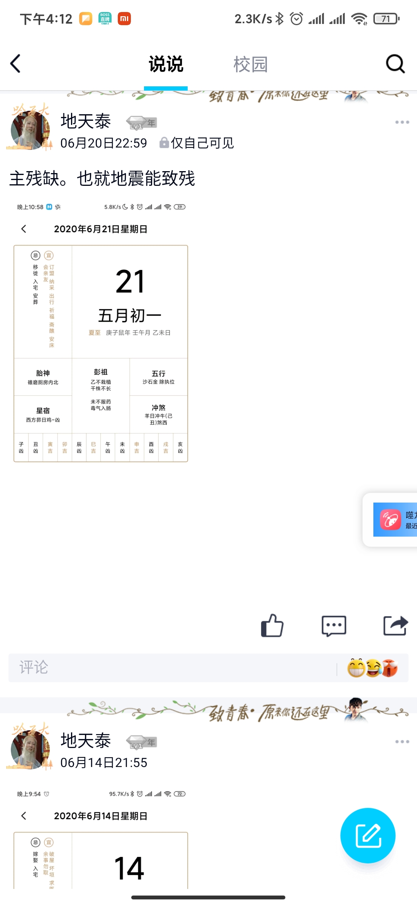

>add by jzf@2020-02-15
# 木有题目

## 地震

今天唐山5级地震，昨晚睡得太晚以至于早上还在睡没啥感觉。想起了之前6月份的一次推算，当时推算的严重性比较大，月份在农历的四月五月，地区倾向于山东的。
现在看了看完全不知道当时是怎么个逻辑，而且之前0208的那片地震分析，现在看起来就跟放屁一样，强行说辞。

## 中医

整个6月份在北京出差，汉庭餐厅提供免费的早餐，期间没啥娱乐和小伙伴一起跑步。吃和活动比较给力，感觉身体好了很多。

* 和同事聊起来角质层的问题，感觉自己油性皮肤，一受刺激就分泌油脂来保护皮肤，异常分泌堵塞毛孔，所以学着用起了护肤品。
    * 买不起高档神水，整了一套大宝（现在已经被强生收购了）的控油套装，感觉还不错。不知道是因为从不用化妆品，第一次效果好的缘故，反正个人体验不错。作证了我认为洗完脸在受干燥风吹电脑手机辐射之前，提前做好保湿，可以缓和油脂分泌，让皮肤休息一下，不要承担那么多的活。
* 精气神的理论，湿气
    * 之前经常嗑药，维生素，逍遥丸，香砂养胃丸，人参健脾丸。效果是有的，但是身体素质还是在波动中下滑。运动之后想了这么一个理论，所谓养生，想要长生久视，要遵守最近本的物质能量守恒。炼精化气，练气化神，炼神返虚这种套路这么去理解。首先要从外界吸收物质转化为自身所需，氧气+食物。
        * 其次要把自身所需的物质，转化为各种活动所需的能量，不能光长膘，消化吸收也好，呼吸也好，跑步举重也好，这一步是炼精化气。
        * 下一步是练气化神。我理解的神是指某种程度上，先天存在，无法溯源，无法认知因果的运动。像呼吸，心跳这种非自主意识，自发的生命的运动。通过跑步我们可以刺激心跳，呼吸，增强心肺功能，使神经调节能力加强，这些运动更加稳定。通过睡眠和休息使神经的电平状态等恢复正常状态。片面的强调腹式呼吸，打坐，都是扯淡。
    * 湿气
        * 现在很多慢性病都归结于湿气。首先我认知的精津血，这三个都是可认知的东西，人的精是人体吸收转化过的物质，津是分泌的，血就是血。湿气现象很多时候都和这三者有关。
            * 口干
                * 津液分泌，血糖。
                * 缺少维生素
            * 便干
                * 水分，食物水分
                * 津液分泌
            * 便粘结
                * 食物油腻
                * 津液分泌
            * 气郁
                * 激素分泌异常
            * 气滞
                * 吃太多，消化能力不够
                * 活动太猛

